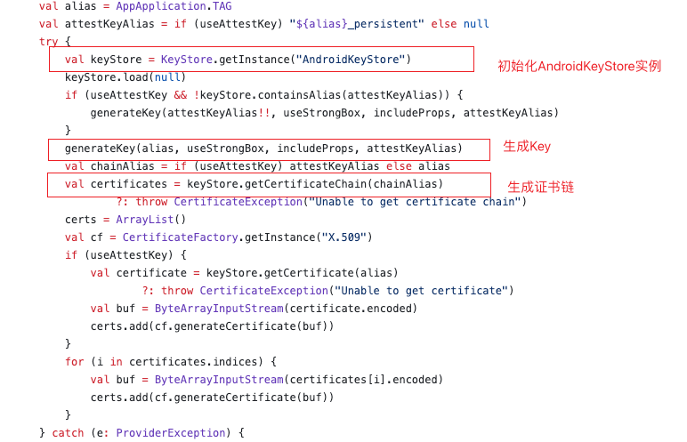
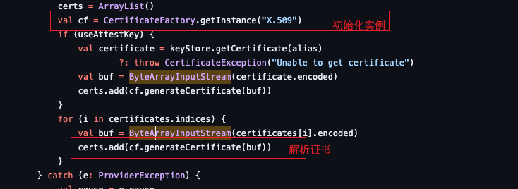
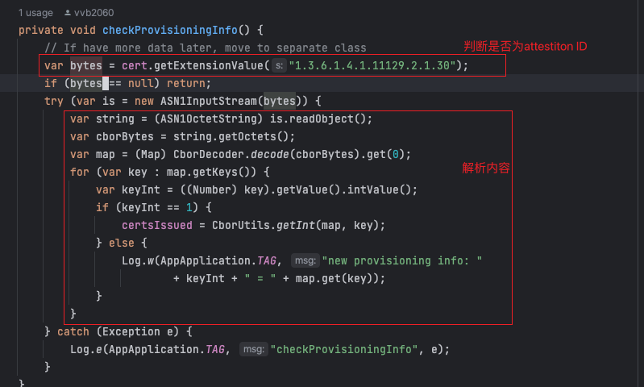
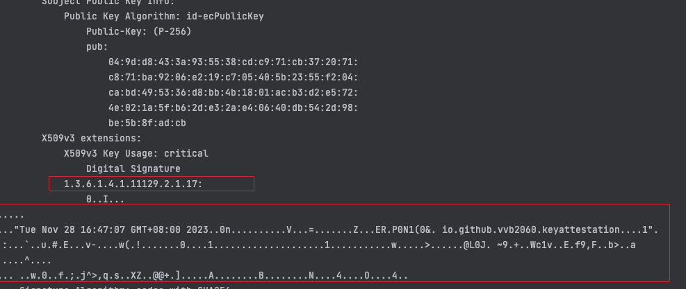
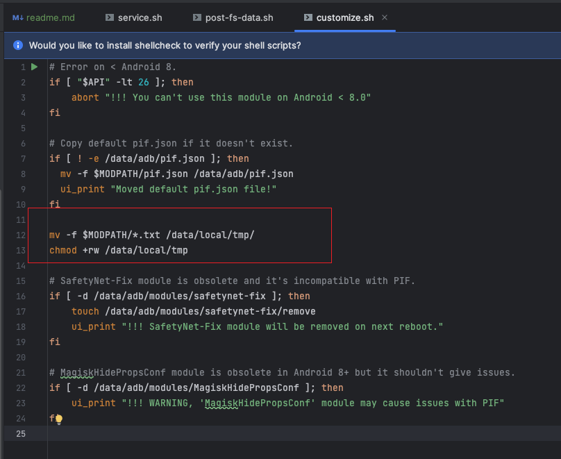
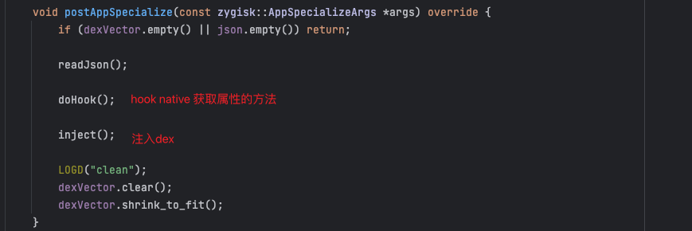

# bypassKeyAttestation 
[TOC]
## Key Attestation 密钥认证

官方文档介绍： https://source.android.com/docs/security/features/keystore/attestation，

个人理解，硬件提供加密功能，同时该硬件模块也会反映设备的软硬件的安全环境。

不想自己实现一套代码的，可以直接用开源的:

 https://github.com/vvb2060/KeyAttestation

功能入口 https://github.com/vvb2060/KeyAttestation/blob/master/app/src/main/java/io/github/vvb2060/keyattestation/home/HomeViewModel.kt  doAttestation方法：
### 获取证书链



生成Key时，通过setAttestationChallenge设置challenge，防止通过旧证书重放。


### 解析证书链



### 对证书链进行校验


### 解析extension，获取设备的状态



格式规范文档： https://source.android.com/docs/security/features/keystore/attestation#attestation-extension 

简单看下解析extension的内容



解析后部分数据

```agsl
Attest version: Keymaster version 4.1
Attest security: StrongBox
Verified boot Key: AAAAAAAAAAAAAAAAAAAAAAAAAAAAAAAAAAAAAAAAAAA= (base64)
Device locked: false
Verified boot state: Unverified

//Hash for boot
//Hashtree metadata for system
//Hashtree metadata for vendor
Verified boot hash: nDqAWissOCsw+aWEm7cEcAkCvQngEE+ypQ75UWakxt4= (base64) 
```


## 饶过手段

思路比较简单，获取到challenge后 ，通过challenge生成新的证书链去替换整条证书链：

1. 可以通过hook java层代码
2. 写一个magisk插件 https://github.com/doom-man/bypasskeyattestation


hook java层已经比较熟练了，由于后续期望强化对异常设备的检测，大多对抗检测的工具又是走magisk插件实现的，打算用magisk插件实现一遍。

参考 https://github.com/chiteroman/PlayIntegrityFix 大佬写的插件进行学习，对大佬拙劣的模仿。


### 准备证书

将证书文件移动/data/local/tmp 下，并提供读权限；



### 注入目标进程

代码入口在cpp/main.cpp 




### 替换证书链


CustomKeyStoreSpi.java 


替换后效果


但是这种情况 ，生成Key用的challenge和实际证书的challenge不同，仍会被检测出来。

在学习下，Xposed插件??? 

> https://developer.android.com/privacy-and-security/security-key-attestation
>
> https://github.com/chiteroman/BootloaderSpoofer

开学！！！！

## 结语

我认为设备异常判定，即使各大厂商去自研解决方案，也应该去学习了解系统层面提供的安全检测手段 和 官方在用的判定方案，我未来的设备异常的方向会往safety net 和 play integrity 靠拢，主要检测点和对抗方案。